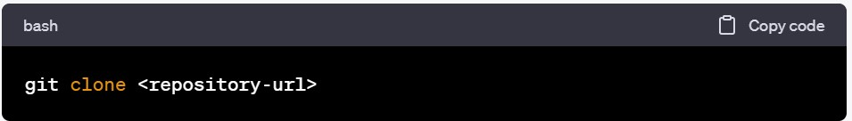

# PayLeave

## Demo


## About PayLeave - Barcode Scanning Payment System

PayLeave is a cutting-edge payment system that enables users to pay for goods and services by scanning barcodes with their smartphone cameras. It eliminates the need for cash or physical cards, offering a fast and convenient payment experience.

## Technology Used

This project is built using:

- **React.js**
- **Tailwind CSS**

## How to Clone This Project

To get a copy of this project up and running on your local machine, follow these steps:

1. **Visit the GitHub Repository**
   - Navigate to the GitHub repository page for this project.

2. **Copy the Repository URL**
   - Click the green "Code" button on the repository page.
   - In the dropdown menu, choose either "HTTPS" or "SSH" based on your preference.
   - Copy the provided URL.

3. **Clone the Repository**
   - Open your terminal or command prompt.
   - Navigate to the directory where you want to clone the project.
   - Run the following command, replacing `<repository-url>` with the URL you copied in step 2:
     ```bash
     git clone <repository-url>
     ```
     

4. **Access the Project**
   - Once cloning is complete, a copy of the repository will be available in your local directory.